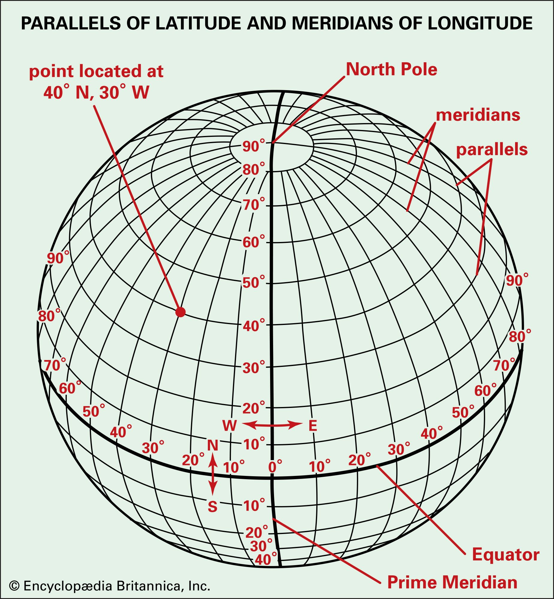
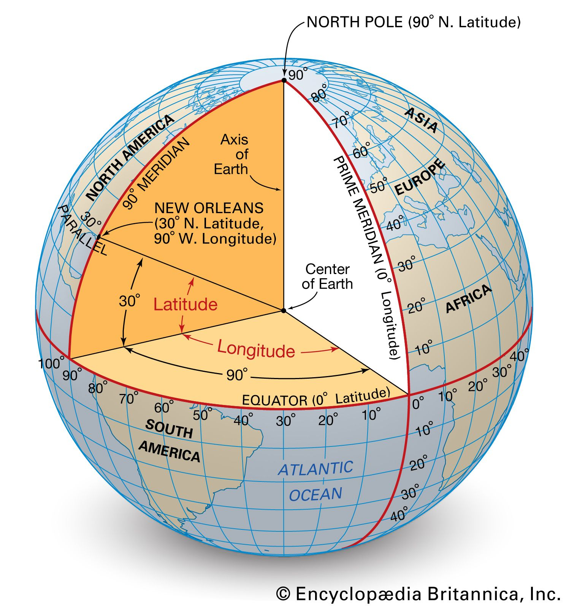

How long is a degree of latitude? How long is a degree of longitude? This are questions someone may have asked when reading about longitude and latitude. With the help of spherical geometry, these questions can be answe
red.

## Length of a degree of latitude (modeling the Earth as a perfect sphere)

Let's imagine, on a sphere, a line of longitude. Meaning, a set of points all having the same longitude with varying latitudes. In geography, this is often called a meridian. So we can use the following illustration to make this derivation:

 
From this, it's easy to see that the formula for the length of an arc of a circle applies:
$$s=R\phi\frac{\pi}{180}$$
where R is the Radius of Earth. Therefore, we can find the length of a degree of latitude by simply making an elementary multiplication.

## Length of a degree of longitude (modeling the Earth as a perfect sphere)

This case is more complicated than the previous one. In these case, we're talking about the case where we are considering a line consisting of points all sharing the same latitude but with different longitudes. In geography, this is often called a parallel. From this figure:

 
the reader may verify that the radius of the a parallel is given by the formula
$$a=R\cos \phi$$

Therefore, using the same arclength-of-a-circle formula from the previous section, one may find the length of a degree of latitude to be
$$s=\frac{\pi}{180}R\cos\phi$$
setting the angle to 1°.
## When taking into account the Earth is not a perfect sphere
In this case, the formulas change and adjust to the bulging of the Earth.It can be shown that the full formula for finding the meridian arc, from the equator to latitude $\phi$, is given by the integral
$$s(\phi)=a(1-e^2)\int_0^\phi(1-e^2\sin^2\phi')d\phi'$$
which is the study of many geodesics texts and can be integrated numerically with the aid of computing techniques.
In case the meridian is small, the integrand is almost constant and therefore can be simplified to, setting the degree difference to 1°:
$$s(\phi)=\frac{\pi R(1-e^2)}{180(1-e^2\sin^2\phi)^{\frac{3}{2}}}$$
While the the arc length of a parallel becomes
$$s_{long}(\phi)=\frac{\pi R \cos \phi}{180\sqrt{1-e^2\sin^2\phi}}$$
Practice problems

## Practice problems
For problems 1-4, assume the Earth is a perfect sphere.
1. I start in Acapulco, Mexico and walk 5500 km in a straight line in the north direction. Where am I now? Assume the Earth is a perfect sphere.
2. I start walking in Bangkok, Thailand and walk 6000 km in a straight line northwards. Where I end up after this journey?
3. A man begins walking from Nantes, France, and finds out he is 1700 km away from his starting point. Where is he now?
4. A person begins walking 5000 km eastward from Baghdad, Iraq. Where is he now?
5. Retry problems 1-4, but now assuming the Earth is an ellipsoid. How much the results differ?
